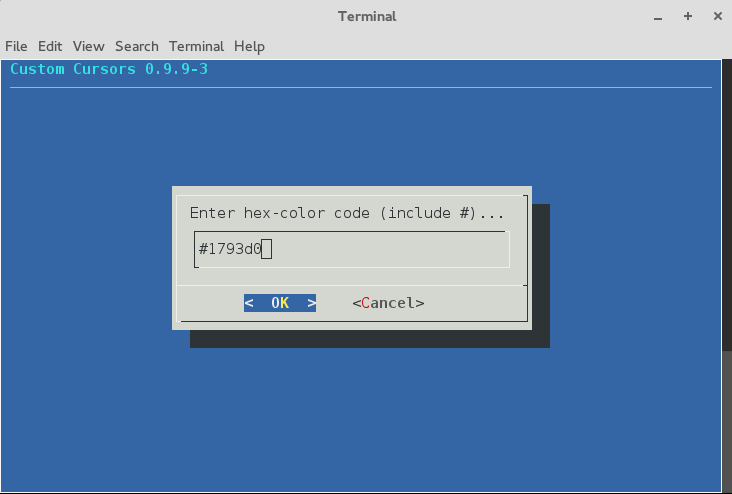

# custom_cursor_testing

testing repo for custom_cursor project. use caution if using anything from this repo.

if testing the script, use arrow keys or mouse to select light/dark
version, then use arrow-keys to highlight color choice, press space
to select, and enter to continue (or again, just use your mouse)

if using a custom-color, a dialog will appear asking you to enter
a custom hex-code for the color. enter your hex-code (including the #)
and press enter or click ok. (the dialog will display until a valid
hex-code has been entered)

